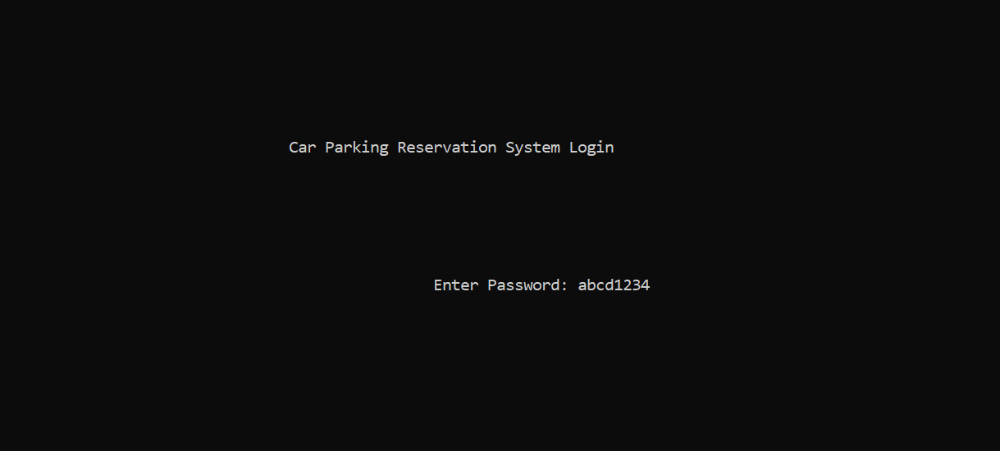
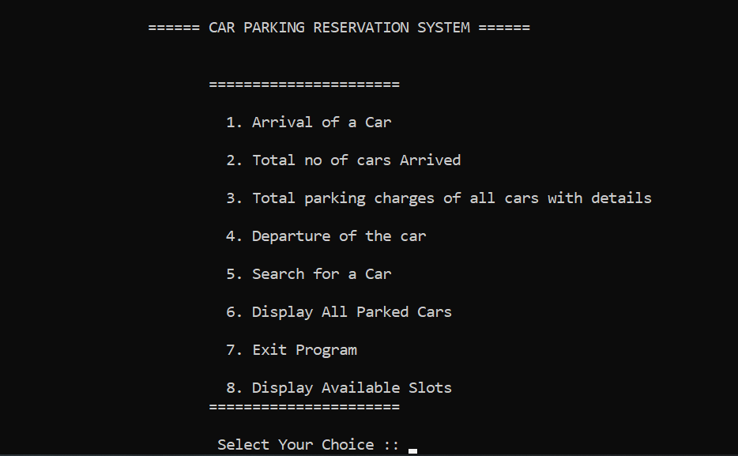

# Parking Reservation System

## Overview
The Parking Reservation System is a console-based application designed to manage parking slots efficiently. It allows users to handle car arrivals, departures, and view parking details. The system is implemented in C and provides a simple interface for managing parking operations.

## Features
- **Car Arrival**: Register a car's arrival and assign it to an available parking slot.
- **Departure**: Remove a car's record upon departure and free up the slot.
- **Search**: Search for a specific car in the parking database.
- **Display All Cars**: View details of all parked cars.
- **Parking Charges**: Calculate and display parking charges based on membership status and parking duration.
- **Available Slots**: Display the number of available parking slots.
- **Exit Program**: Safely exit the application.

## How It Works
1. **Authentication**: The system requires a password to access the main menu.
2. **Menu Options**: Users can choose from various options to manage parking operations.
3. **File Storage**: Parking data is stored in a file (`parkingProjectFile.txt`) for persistence.

## Updated File Structure
- `technicalFiles/myproject.c`: Main source code for the application.
- `ProjectResources/Flow-Chart.png`: Flow chart image.
- `ProjectResources/Flow-Chart.svg`: Flow chart in SVG format.
- `ProjectResources/mainMenu.png`: Main menu image.
- `ProjectResources/starting.png`: Starting screen image.

## How to Run
1. Compile the source code using a C compiler (e.g., GCC).
   ```bash
   gcc -o parkingSystem technicalFiles/myproject.c
   ```
2. Run the compiled executable.
   ```bash
   ./parkingSystem
   ```

## Dependencies
- Standard C libraries (`stdio.h`, `stdlib.h`, `string.h`).
- Platform-specific headers for clearing the screen (`windows.h` for Windows, `unistd.h` for others).

## Future Enhancements
- Add a graphical user interface (GUI).
- Implement a database for better data management.
- Add support for multiple parking lots.

## Screenshots
- **Starting Screen**: 
- **Main Menu**: 
- **Flowchart**: 


## License
This project is open-source and free to use.